<!-- comentario ... -->
# Atividade Prática — Docker + Compose + CI/CD

**Curso:** Desenvolvimento Fullstack  
**Módulo:** Módulo 11 - DevOps  
**Professor:** Virgílio Borges  

---

## 🚀 Sobre o Projeto
Este repositório contém a conteinerização e automação de CI/CD para a aplicação *getting-started-app* (gerenciador de tarefas To-Do em Node.js) utilizando **Docker**, **Docker Compose** e **GitHub Actions**.

---

## 📸 Evidências e Telas

### Parte 1 — Dockerfile Multi-Stage
> **Por que o Multi-Stage ajuda no tamanho e na segurança da imagem final?**  
> O multi-stage build permite separar o ambiente de compilação/instalação de dependências do ambiente de execução final. Isso resulta em uma imagem significativamente menor (removendo compiladores e arquivos temporários de build) e mais segura, reduzindo a superfície de ataque ao manter apenas o estritamente necessário para rodar o app e utilizando um usuário não-root.

* **Tamanho da Imagem e Build:**
  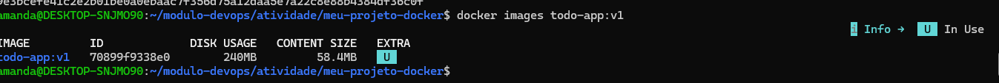

* **Aplicação rodando no navegador:**
  

---

### Parte 2 — Volume e Persistência

* **Perda de dados (Sem Volume):**  
  Quando o container é destruído e recriado sem volume, o banco SQLite local `/etc/todos/todo.db` é descartado junto com o container.
  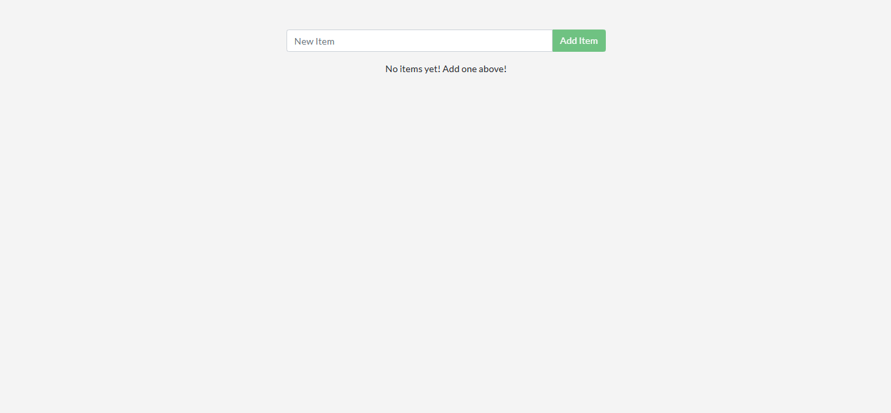

* **Persistência de dados (Com Volume):**  
  Com o volume nomeado `todo-db` montado em `/etc/todos`, os dados persistem mesmo após recriar o container.
  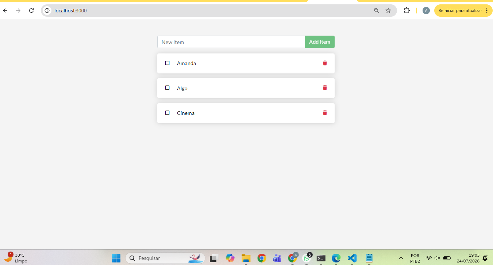

---

### Parte 3 — Rede entre Containers

* **Inspeção da Rede (`docker network inspect todo-net`):**
  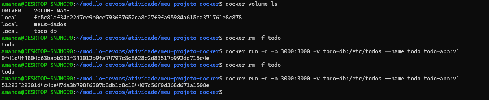

> **Por que o app consegue chamar o host `mysql` sem saber o IP dele?**  
> O Docker possui um servidor DNS interno integrado que resolve automaticamente o nome do serviço ou alias da rede (`mysql`) para o endereço IP interno do container correspondente.

---

### Parte 4 — Docker Compose

* **Serviços rodando (`docker compose ps`):**
  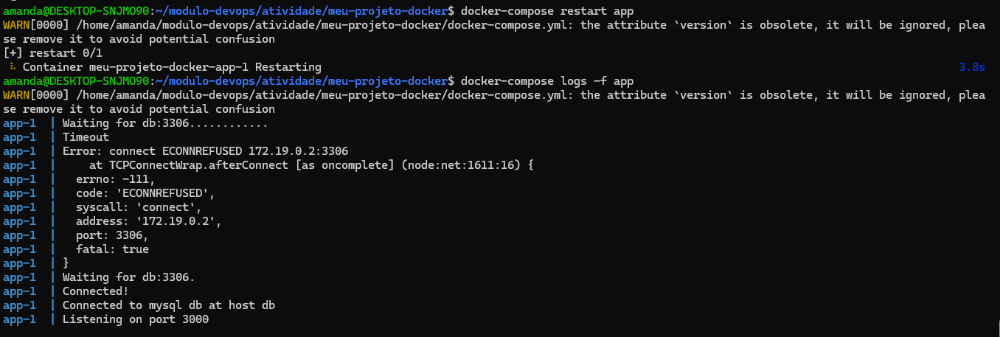

> **Diferença entre `docker compose down` e `docker compose down -v`:**  
> O `docker compose down` para e remove os containers e redes da stack, preservando os volumes montados. Já o `docker compose down -v` remove também os volumes nomeados, apagando todos os dados persistidos do banco.

---

### Parte 5 e 6 — CI com GitHub Actions e Quebra Proposital

* **Execução do CI com Sucesso (Verde):**
  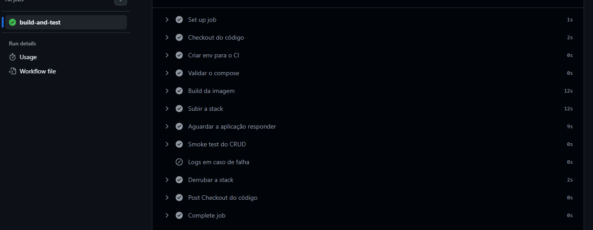

* **Execução do CI com Falha Intencional (Vermelha) + Log do Erro:**
  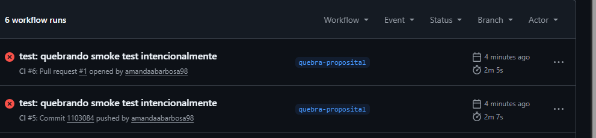
  

> **Relatório da Quebra Proposital do CI:**  
> **O que foi quebrado:** Alterada a URL do *smoke test* de `/items` para uma rota inexistente `/itemsss` no arquivo `ci.yml`.  
> **Como o CI reagiu:** A etapa *Smoke test do CRUD* falhou ao tentar executar o `curl`, pois a API retornou erro HTTP (404 Not Found), interrompendo a execução do workflow e disparando a exibição dos logs do Compose.  
> **Como o problema foi identificado:** Através dos logs do job no GitHub Actions, que mostraram a falha do comando `curl` ao tentar acessar a rota alterada `/itemsss`.

---

## 🛠️ Relatório de Execução: Acertos, Erros e Dificuldades

### Parte 1 — Dockerfile Multi-Stage
* **Acertos:** Configuração adequada do isolamento de camadas mantendo o `package.json` separado para otimizar o cache de build.
* **Dificuldades/Erros:** Garantir que as permissões de usuário não-root fossem aplicadas corretamente nos diretórios de trabalho sem quebrar a execução do Node.js.

### Parte 2 — Volume e Persistência
* **Acertos:** Verificação clara do comportamento do SQLite ao destruir containers avulsos com e sem binding de volumes nomeados.
* **Dificuldades/Erros:** Certificar-se de limpar containers antigos antes de subir novas instâncias sob a mesma porta `3000`.

### Parte 3 — Rede entre Containers
* **Acertos:** Conexão bem-sucedida entre o app e o MySQL na mesma rede bridge customizada usando aliases DNS.
* **Dificuldades/Erros:** Aguardar a inicialização completa das tabelas do MySQL antes de tentar conectar a aplicação Node.js.

### Parte 4 — Docker Compose
* **Acertos:** Criação de uma stack declarativa com `healthcheck` no banco de dados e dependência condicional (`service_healthy`) no container do aplicativo.
* **Dificuldades/Erros:** Mapeamento correto do arquivo `.env` para evitar expor senhas em texto puro no repositório.

### Parte 5 & 6 — CI com GitHub Actions
* **Acertos:** Implementação completa da esteira de automação (validação de sintaxe, build, inicialização da stack, smoke test via `curl` e encerramento limpo da stack).
* **Dificuldades/Erros:** Ajustar o *loop* de espera (`sleep`) na etapa de aquecimento para garantir que o container estivesse 100% pronto antes da execução do *smoke test*.

---

## 📦 CD — Publicação no Docker Hub

* **Aluno(a):** Amanda Barbosa[cite: 2]  
* **Turma:** Fullstack ITEAM — Módulo DevOps  
* **Usuário do Docker Hub:** `amandaabarbosa98`  
* **Imagem publicada:** `amandaabarbosa98/meu-projeto-docker:latest` 
* **Link da imagem no Docker Hub:** [https://hub.docker.com/r/amandaabarbosa98/meu-projeto-docker](https://hub.docker.com/r/amandaabarbosa98/meu-projeto-docker)
* **Dispara quando:** Push na branch `main`
* **Arquivo do workflow:** `.github/workflows/cd.yml`  

* **Print 1 — Token criado no Docker Hub:**  
  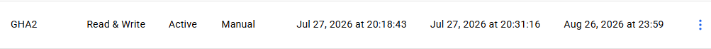

* **Print 2 — Secrets cadastrados no GitHub (`DOCKERHUB_USERNAME` e `DOCKERHUB_TOKEN`):**  
  

* **Print 3 — Workflow de CD verde na aba Actions:**  
  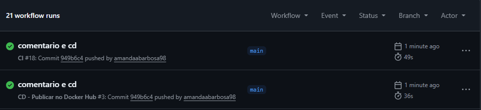

* **Print 4 — Imagem publicada no Docker Hub:**  
  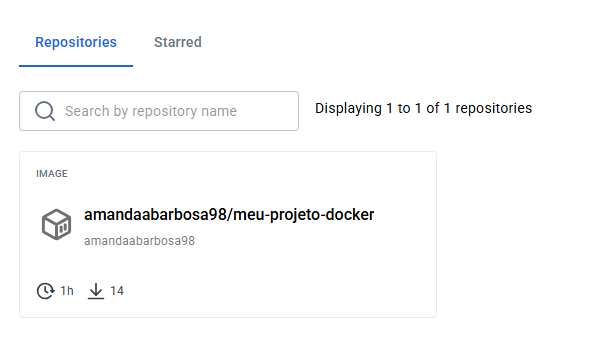

* **Print 5 — `docker pull` baixando a imagem publicada:**  
  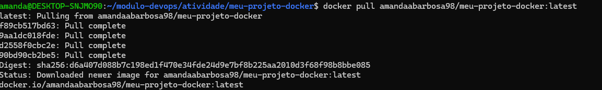

### Respostas

1. **O que é o Docker Hub?**  
   É um registro público e remoto de imagens Docker na nuvem (análogo ao GitHub para código). Ele permite armazenar, versionar, distribuir e compartilhar imagens de containers prontas para execução em qualquer ambiente.

2. **Diferença entre CI e CD:**  
   O **CI (Continuous Integration)** foca na validação do código, automatizando builds e testes a cada envio para garantir estabilidade. O **CD (Continuous Delivery/Deployment)** assume após o CI ser aprovado, automatizando o empacotamento e a entrega contínua do artefato final (a imagem Docker) na prateleira/registro para uso final.

3. **Por que usar token e Secrets em vez de escrever usuário e senha no `cd.yml`?**  
   Por segurança[cite: 1]. Escrever credenciais diretamente em um arquivo do repositório expõe sua senha publicamente no Git. As Secrets funcionam como um cofre criptografado e o Personal Access Token concede uma autorização com escopo limitado que pode ser revogada sem alterar a senha principal da conta.

4. **O que significa a tag `latest`?**  
   Indica a versão padrão e mais recente (*latest build*) publicada de uma imagem em um repositório. Ela aponta automaticamente para a última build gerada na branch principal quando nenhuma tag numérica de versão é especificada.

---

## ✅ Checklist de Entrega

- [x] Repositório **público** no GitHub com histórico de commits (sem commit único "final")
- [x] `Dockerfile` multi-stage funcional + `.dockerignore`
- [x] `compose.yaml` com rede, volume nomeado, variáveis de ambiente e `healthcheck`
- [x] `.env.example` versionado e `.env` ignorado
- [x] Workflow do GitHub Actions funcionando
- [x] Um PR com o CI vermelho e depois verde (histórico visível)
- [x] Workflow de CD (`cd.yml`) configurado e publicando no Docker Hub
- [x] Secrets `DOCKERHUB_USERNAME` e `DOCKERHUB_TOKEN` configuradas
- [x] README preenchido com todos os prints pedidos e as respostas das perguntas.
- [x] Link do repositório enviado ao professor.
